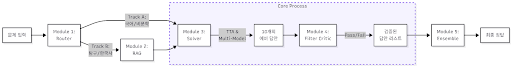
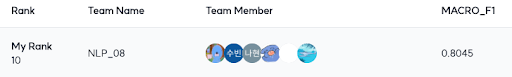
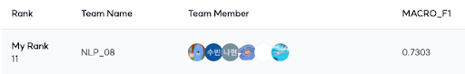

# 💯 수능형 문제 풀이 모델 생성
> Naver BoostCamp AI Tech 8기 NLP 트랙 프로젝트


## ✅ 프로젝트 소개
대부분의 대형 LLM은 한국어에 완벽히 최적화되지 않았음에도 불구하고 수능에서 꽤 높은 성적을 기록하고 있습니다. 작은 모델로도 대형 LLM 성능을 능가하는 성적을 낼 수 있는지, 한국어의 특성과 수능 시험의 특징을 바탕으로 수능에 특화된 AI 모델을 개발하는 것이 본 프로젝트의 목적입니다.

## 🔍 데이터 셋
수능의 국어, 사회 영역(운리, 정치, 사회)과 비슷한 문제로 `수능형 문제`,`KMMLU (Korean History)`, `MMMLU (HighSchool 데이터 중 역사, 정치, 지리, 심리)`, `KLUE MRC (경제, 교육산업, 국제, 부동산, 사회, 생활, 책마을)` 데이터로 구성되어 있습니다.
|항목|내용|
|---|---|
|<b>학습 데이터|KMMLU/MMMLU(Ko), KLUE MRC 데이터 중 2031개|
|<b>평가 데이터|수능형 문제, KMMLU(Ko), KLUE MRC 데이터 총 869개|

## 💡 프로젝트 진행
### ◼ 타임라인 
> <b>프로젝트 기간</b> | 2025.12.17 ~ 2026.01.06

### ◼ 평가 지표
불균형한 데이터 분포를 고려하여 Macro F1-score를 메인 지표로 사용합니다.

$$Macro F1 = \frac{1}{N}\sum_{i=1}^{N}F1_{i}$$

### ◼ 프로젝트 요약
|항목|내용|
|--|--|
|<b>평가 지표|MARCO F1-score|
|<b>개발 환경|V100 32G server|
|<b>협업 환경|GitHub, Slack, Zoom |

## 👨‍💻 역할 분담
|팀원|역할|GitHub|
|--|--|--|
|<b>박제혁|전체 파이프라인 설계, BaseLLM 추상화, Batch Solver 및 DataLoader 구현, 노드 디버깅|[@2eeg](https://github.com/2eeg)|
|<b>곽나현|Router 모듈 구현, 베이스 모델 선정(lm-harness), Logit 생성 결과 실험|[@kkwakna](https://github.com/kkwakna)|
|<b>김대민|EDA 수행, Solver 모듈 로짓 기반 파인튜닝 및 성능 실험|[@KDM777](https://github.com/KDM777)|
|<b>박도현|VectorDB 구축, RAG Retrieval 모듈 구현, Critic 및 Ensemble 모듈 초기 설계|[@ManRaccoon](https://github.com/ManRaccoon)|
|<b>오수빈|데이터 레이블링, Solver 평가기 제작, TTA/Few-shot/파라미터 튜닝 실험|[@OhSuBin13](https://github.com/OhSuBin13)|
## ⚙ 시스템 구조
> 본 시스템은 수능형 문제를 해결하기 위해 설계된  LangGraph 기반 Multi-Agent AI 시스템입니다. 
<br>



1️⃣ Router 모듈 (Module 1: 분석 및 분기)

입력된 데이터의 특징을 분석하여 파이프라인의 처리 경로를 동적으로 결정합니다.

- 선지 개수 기반 라우팅: EDA 결과를 통해 발견된 선지 개수와 문제 유형 간의 상관관계를 활용합니다.

    - Track A (5지선다): 지문 내에 충분한 정보가 있는 'KLUE MRC' 유형으로 판단하여 RAG를 생략하고 Solver로 즉시 전달합니다.

    - Track B (4지선다): 외부 배경지식이 필수적인 'KMMLU/MMMLU' 유형으로 판단하여 Retrieval 모듈로 전달합니다.

- 효율성: 불필요한 검색 과정을 생략함으로써 전체 처리 속도를 2배 이상 개선했습니다.

2️⃣ Retrieval 모듈 (Module 2: 지식 보강)

Track B 문제에 대해 부족한 배경지식을 보충하는 RAG(Retrieval-Augmented Generation) 과정을 수행합니다.

- Hybrid Embedding: BAAI/BGE-M3 모델을 사용하여 문맥 중심의 Dense 검색과 키워드 중심의 Sparse 검색을 결합하였습니다.

- Vector DB (Qdrant): 위키백과 덤프 데이터를 800자 단위로 청킹하여 저장하고, 높은 메모리 효율성으로 하이브리드 검색을 지원합니다.

- 데이터 최적화: 위키백과 데이터를 교육과정 핵심 키워드로 필터링하여 기존 대비 20% 수준으로 압축 관리합니다.

3️⃣ Solver 모듈 (Module 3: 다중 추론 및 TTA)

확보된 지문과 배경지식을 바탕으로 문제 풀이를 수행하며, 모델의 고유한 편향을 제거하기 위한 알고리즘을 적용합니다.

- TTA (Test-Time Augmentation): 선지 위치에 따른 편향(Positional Bias) 가설을 바탕으로, 동일 문제에 대해 선지 순서를 5가지로 재배열하여 독립적인 추론을 수행합니다. 이후 Index Mapping을 통해 원본 번호로 역변환하여 결과를 취합함으로써 F1 score 2.4%, Accuracy 3%의 향상을 달성하였습니다.

- Zero-shot CoT 전략: 'Reasoning(추론) 선행 후 Answer(정답) 도출' 방식을 적용하여 인과 관계를 명확히 하였으며, 실험을 통해 예시 편향을 일으키는 Few-shot 대신 Zero-shot 방식을 최종 채택하였습니다.

- 다중 모델 결과 생성: Qwen2.5-32B와 Qwen3-32B 모델을 활용하여 각 TTA 버전별로 최종 10개의 '정답-풀이 과정' 쌍을 생성하여 검토 단계로 넘깁니다.

4️⃣ Critic 모듈 (Module 4: 논리 검증)

Solver가 도출한 결과의 품질을 관리하는 단계입니다.

- 다중 검증: 생성된 풀이 결과 하나하나에 대해 지문 내용과의 모순 여부, 정보 날조 여부 등을 검토합니다.

- Pass/Fail 판정: 구체적인 기준(논점 이탈 등)을 통해 부적절한 답안을 사전에 제거하여 신뢰도를 확보합니다.

5️⃣ Ensemble 모듈 (Module 5: 최종 합의)

검증을 통과한 답안 리스트를 종합하여 최종 정답을 확정합니다.

- Hard Voting: 서로 다른 모델(Qwen2.5-32B, Qwen3-32B)의 예측 결과를 앙상블하여 개별 모델의 편향을 상호 보완합니다.

- 성과: 클래스 불균형이 높은 데이터셋에서 소수 클래스에 대한 예측력을 개선하여 F1-score를 약 1.33% 상승시켰습니다.

## 🚀 실행 방법

1. uv sync를 통해 의존성 동기화

    ```bash
    uv sync
    ```

2. uv 가상환경 실행
    ```bash
    source .venv/bin/activate
    ```

3. 프로그램 실행
    ```bash
    uv run main.py
    ```

- Qdrant 서버 설치 및 사용법
    ```bash
    wget https://github.com/qdrant/qdrant/releases/latest/download/qdrant-x86_64-unknown-linux-musl.tar.gz && \
    tar -xvf qdrant-x86_64-unknown-linux-musl.tar.gz && \
    rm qdrant-x86_64-unknown-linux-musl.tar.gz && \
    chmod +x qdrant && \
    ./qdrant
    ```
    
- vectorDB
    - collection_name = COLLECTION_NAME
    - 원시 text chunking 시 "문서 제목:제목>\n\n<본문>" 형식으로 전처리하였습니다.


## 📁 프로젝트 구조

```bash
CSAT-Solver/
├── assets/                 # README용 이미지, 아키텍처 다이어그램 등 리소스 저장소
├── config/                 # [설정] Hydra 프레임워크 기반의 환경 설정 폴더
│   ├── model/              # 모델 관련 설정 분리 (Qwen, BGE-M3 등)
│   │   └── qwen_32b.yaml   # Qwen-32B 모델 로드 설정 (경로, 양자화 등)
│   ├── path/               # 데이터, 로그, 체크포인트 경로 정의
│   │   └── default.yaml
│   ├── prompt/             # 프롬프트 템플릿 관리 (코드와 프롬프트 분리)
│   │   ├── critic.yaml     # 비평(Critic) 노드용 프롬프트
│   │   ├── router.yaml     # 라우터(Router) 노드용 프롬프트
│   │   └── solver.yaml     # 풀이(Solver) 노드용 프롬프트
│   └── config.yaml         # 메인 설정 파일 (전역 파라미터 관리)
├── data/                   # [데이터] 학습 및 평가 데이터 저장소
│   ├── raw/                # 원본 데이터 (수정 금지)
│   └── processed/          # 전처리된 데이터 (RAG 데이터, Stratified Split 등)
├── notebooks/              # 실험용 주피터 노트북 (EDA, 프로토타이핑)
├── outputs/                # [출력] 실행 결과물 저장소
│   ├── checkpoints/        # 학습된 모델 가중치 저장 (.pt, .safetensors)
│   └── submissions/        # 대회 제출용 답안 파일(csv 등) 저장
├── src/                    # [소스] 핵심 소스 코드
│   ├── agent/              # LangGraph 에이전트 관련 로직
│   │   ├── nodes/          # 그래프의 각 단계(노드) 구현
│   │   │   ├── router.py   # [판단] 검색/직접풀이 경로 결정
│   │   │   ├── solver.py   # [추론] 문제 풀이 수행
│   │   │   └── retrieval.py# [도구] 위키피디아 등 외부 정보 검색 실행
│   │   ├── graph.py        # StateGraph 정의 (Workflow 전체 구조)
│   │   └── state.py        # TypedDict 상태(State) 스키마 정의
│   ├── base/               # 베이스 클래스 및 추상화 노드
│   ├── data_loader/        # 데이터 로딩 및 배치 처리 로직
│   ├── model/              # 모델 로더 및 LLM 인터페이스
│   ├── trainer/            # 파인튜닝 및 학습 프로세스
│   └── utils/              # 공통 유틸리티 (로거, 설정 로더 등)
├── .gitignore              # Git 제외 파일 설정
├── README.md               # 프로젝트 소개 및 실행 가이드
├── pyproject.toml          # 프로젝트 의존성 및 메타데이터 설정 (uv 사용 시)
├── uv.lock                 # 의존성 패키지 버전 잠금 파일
├── main.py                 # 메인 실행 스크립트
└── inference.py            # 추론 전용 스크립트
```

## 🎯 최종 결과

- **Public 리더보드**: 10위

    

- **Private 리더보드**: 11위

    


### 주요 인사이트
- Multi-Agent 아키텍쳐의 강건성 : 단순 단일 모델 추론의 한계를 극복하기 위해 LangGraph 기반의 Agentic Workflow를 구축하였습니다. 이를 통해 문제 분석, 지식 검색, 답안 검증을 독립적인 노드로 분리하여 고난도 추론 문제에서도 안정적인 성능을 확보했습니다.

- 모듈화된 디렉토리 구조 및 확장성 : LangGraph의 노드 기반 설계를 프로젝트 디렉토리 구조에 그대로 투영하여 코드의 가독성과 유지보수성을 극대화했습니다. 각 기능을 독립적인 모듈로 관리함으로써 새로운 풀이 전략이나 모델을 신속하게 추가 및 테스트할 수 있는 환경을 조성했습니다.

- 효율적인 대형 모델 Fine-tuning : Unsloth 라이브러리를 적극 활용하여 Qwen-32B와 같은 대형 언어 모델(LLM)을 한정된 GPU 자원에서도 효율적으로 파인튜닝했습니다. 이를 통해 모델의 기본 추론 능력을 유지하면서도 수능 특유의 문제 풀이 형식을 완벽히 학습시켰습니다.

- 구조화된 출력의 안정화 : 정교한 프롬프트 엔지니어링과 Robust한 JSON 파싱 로직을 결합하여, LLM이 복잡한 사고 과정(Reasoning)과 최종 정답을 정해진 스키마에 따라 정확히 출력하도록 제어했습니다. 이는 후속 단계인 Critic 및 Ensemble 노드의 데이터 처리 신뢰도를 높이는 결정적 역할을 했습니다.

### 한계점
- 하드웨어 자원 제약 : 다수의 고성능 LLM(Qwen-32B 등)을 동시에 로드하는 Multi-Agent 구조 특성상, V100 환경에서 메모리 병목 현상이 발생하였습니다. 이를 해결하기 위해 양자화(Quantization)를 적용했으나, 이 과정에서 발생하는 추론 지연(Latency)과 미세한 성능 손실 사이의 트레이드오프(Trade-off)를 완벽히 해소하는 데 어려움이 있었습니다.

- 단방향 워크플로우의 제약 : 현재 시스템은 Router에서 Ensemble까지 이어지는 직렬적인 구조로 설계되어 있습니다. Critic 노드에서 오류를 발견하더라도 이를 즉각적으로 Solver에게 피드백하여 수정할 수 있는 루프 구조가 부재하여, 모델이 스스로 정답을 교정할 수 있는 'Self-Correction' 기회를 충분히 활용하지 못했습니다.

### 차후 개선 방향
- Knowledge Distillation : 32B 이상의 대형 모델이 가진 추론 능력을 7B~8B 규모의 소형 모델에 이식하여 추론 성능은 유지하면서도 시스템 운영의 효율성과 속도를 획기적으로 개선하고자 합니다.

- 자원 효율적 앙상블 기법: 단일 GPU 메모리 점유를 최소화하면서 앙상블 효과를 극대화하기 위해 LoRAX, MC Dropout과 같은 방법론을 차용하여, 하나의 베이스 모델을 다각도로 활용하는 기술을 검토 중입니다.

- Self-Refine 루프 도입 및 피드백 자동화 : Critic 노드에서 'Fail' 판정이 내려질 경우, 구체적인 논리 결함 사유를 Solver에게 전달하여 답안을 재생성하는 Self-Refine 루프를 구현하여 에이전트의 자율성을 높이고 정답 도출의 정밀도를 극대화하고자 합니다.

## 📚 참고 자료

### 논문
- [Retrieval-Augmented Generation for Knowledge-Intensive NLP Tasks](https://arxiv.org/abs/2005.11401)
- [Chain-of-Thought Prompting Elicits Reasoning in Large Language Models](https://arxiv.org/abs/2201.11903)
- [Large Language Models Are Not Robust Multiple Choice Selectors](https://arxiv.org/abs/2309.03882)

### 모델
- [unsloth/Qwen2.5-32B-Instruct-bnb-4bit](https://huggingface.co/unsloth/Qwen2.5-32B-Instruct-bnb-4bit)
- [Qwen/Qwen2.5-7B-Instruct](https://huggingface.co/Qwen/Qwen2.5-7B-Instruct)
- [unsloth/Qwen3-32B-bnb-4bit](https://huggingface.co/unsloth/Qwen3-32B-bnb-4bit)
- [BAAI/bge-m3](https://huggingface.co/BAAI/bge-m3)

## 🤝 기여

본 프로젝트는 Naver BoostCamp AI Tech 8기 NLP-08팀의 협업 결과물입니다.

## 📝 라이선스

This project is licensed under the MIT License - see the [LICENSE](LICENSE) file for details.

## 📧 연락처

프로젝트에 대한 문의사항이 있으시면 이슈를 등록해주세요.

---

<div align="center">

**Made with ❤️ by NLP-08 Team**

*Naver BoostCamp AI Tech 8th | 2026.01*

</div>

